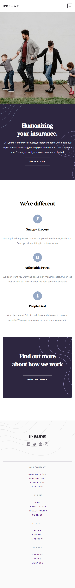

# Frontend Mentor - Insure landing page solution

This is a solution to the [Insure landing page challenge on Frontend Mentor](https://www.frontendmentor.io/challenges/insure-landing-page-uTU68JV8). Frontend Mentor challenges help you improve your coding skills by building realistic projects. 

## Table of contents

- [Overview](#overview)
  - [The challenge](#the-challenge)
  - [Screenshot](#screenshot)
  - [Links](#links)
- [My process](#my-process)
  - [Built with](#built-with)
  - [What I learned](#what-i-learned)
  - [Continued development](#continued-development)
  - [Useful resources](#useful-resources)
- [Author](#author)
- [Acknowledgments](#acknowledgments)

## Overview

### The challenge

Users should be able to:

- View the optimal layout for the site depending on their device's screen size
- See hover states for all interactive elements on the page

### Screenshot

Desktop View

Mobile View

### Links

- Solution URL: [Github Repo](https://github.com/GentryHQ/Insure-LP)
- Live Site URL: [Github Pages](https://gentryhq.github.io/Insure-LP/)

## My process

### Built with

- Semantic HTML5 markup
- CSS custom properties
- Flexbox
- CSS Grid
- Mobile-first workflow
- SASS/SCSS: CSS preprocessor

### What I learned

- My first time using SASS, and I learnt a lot from building this project with SASS... From Syntax to best practices to functions and other superpower with SASS. Although my code was a little rough around the end as I just trying to grasp the concepts in SASS.

- I did little animation with CSS which I haven't tried out before.

### Continued development

- I will definitely continue with sass for my future projects, I will also like to rebuild this project sometimes in the future with SASS. 

### Useful resources

- Brad Travesy YT Channel - Brad has a nicely done and well explained video on SASS. And this was the first tutorial I watched before doing anything with SASS. You should take a look

- The Net Ninja YT Channel - Here, a playlist that walk you through installation to very advance level on SASS.

## Author

- Website - [Gentry.com.ng](https://www.gentry.com.ng)
- Frontend Mentor - [@GentryHQ](https://www.frontendmentor.io/profile/GentryHQ)
- Twitter - [@iam_gentry](https://www.twitter.com/iam_gentry)

